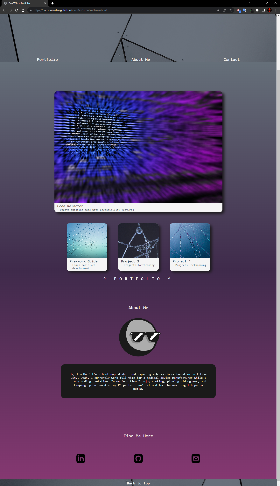

# mod02-Portfolio-DanWilson

## Description
Module 02 challenge for bootcamp to design a personal website using HTML/CSS to act as a project portfolio showcase.

Objectives for this challenge:

- Website should have responsive layout that adapts to viewports or different display sizes
- Navigation links and UI elements should function correctly
- Developer's information should be displayed
- Additional bootcamp course specific grading criteria

## Installation

N/A

## Usage

Visit the site here: [Dan's Dev Profile](https://part-time-dan.github.io/mod02-Portfolio-DanWilson/#contact)

On a PC/laptop, change your browser to windowed view (or use Chrome dev tools to 'Inspect') and try resizing the browser to see various elements on the page react to fit the window. Also, move the cursor over elements and experience visual feedback to communicate interactive elements to the user.

Note: Currently, links are only available for 2 projects as the bootcamp has only progressed 2 weeks as of 4/26/2023.

## Contributions

All images provided license-free from stock photo sites like [Pexels](https://www.pexels.com/). Code written based on in-class training and available public tutorials for basic web development learning.

## License

N/A

## Deployed Git Page Screenshot

